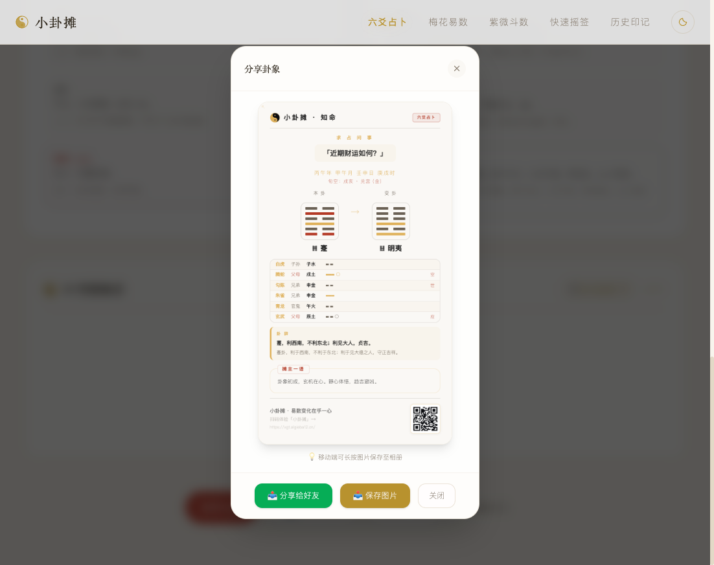

# 🔮 小卦摊 (Divination App)

一个基于传统易学与现代 AI 结合的国风排盘占卜应用。集成 **周易六爻**、**梅花易数** 与 **紫微斗数** 三大核心占卜与命理系统，搭配 DeepSeek LLM 提供通俗易懂的口语化 AI 智能解读，并支持自定义海报分享。

---

## ✨ 核心特性与功能

### 🪙 1. 周易六爻占卜
*   **完整仪式模式**：模拟传统起卦，提供 6 次手摇铜钱动画交互。
*   **快速排盘模式**：一键生成本卦与变卦，适合快捷推算。
*   **专业纳甲排盘**：自动排出月建、日建、旬空、用神、世应，并标注六神（青龙、朱雀等）与爻位干支。
*   **AI 摊主解卦**：输出标准的“占断结论卡片（包含结论、置信度、应期）”、“摊主一语”与详细的六步解卦依据链路。

### 🌸 2. 梅花易数起卦
*   **数字起卦法**：支持输入三个数字推演上卦、下卦与动爻。
*   **时间起卦法**：基于公历时间，自动换算阴历干支进行天人感应起卦。
*   **体用互变参断**：清晰展示本卦、互卦、之卦，自动计算体卦、用卦及五行生克关系。

### ⭐ 3. 紫微斗数排盘
*   **星盘精密演算**：根据生辰性别，精确定位十二宫垣，排出十四主星、吉煞辅星。
*   **四柱八字与命身主**：自动推算命主、身主、生年干四化（禄、权、科、忌）并高亮展示。
*   **运势大限流动**：清晰计算各宫位对应的十岁大限及流年岁数流动。
*   **全景 4x4 命盘展示**：以经典的古代命盘九宫格/十二宫环绕格式呈现。

### 📋 4. 增强辅助工具
*   **一键复制 AI 提示词**：每个算法均支持一键复制包含完整盘面参数与系统设定的 Markdown 提示词，方便用户离线向外部 ChatGPT/Claude/DeepSeek 进行二次追问与深度探讨。
*   **动态分享海报**：生成国风美学的分享海报，自动包含求占问题、起卦盘面、AI 核心结论以及可动态扫码访问的二维码。
*   **历史卦记管理**：本地存储最多 500 条占卜记录，支持准确度标记、添加备注与一键清空。

---

## 📷 界面与海报演示

### 六爻起卦与海报分享


### 紫微天星排盘分享


---

## 🛠️ 本地安装与启动

项目基于 **Vite + React + TypeScript + TailwindCSS** 构建。

```bash
# 1. 克隆项目并进入前端目录
cd divination-app

# 2. 安装依赖包
npm install

# 3. 启动开发服务器
npm run dev
```

打开浏览器访问 `http://localhost:5173` 即可预览。

---

## ⚙️ 环境变量配置 (`.env`)

在项目根目录下创建 `.env` 文件，可配置以下参数：

```ini
# DeepSeek / OpenAI 兼容接口配置
API_KEY=your_deepseek_api_key_here
BASE_URL=https://api.deepseek.com
MODEL=deepseek-chat

# 部署站点的 URL（用于生成分享二维码，非必填，默认 fallback 为当前访问域名）
VITE_SITE_URL=https://your-domain.com

# 生产环境强制重定向域名（可选，用于规范多域名访问）
VITE_REDIRECT_DOMAIN=

# Google Analytics 衡量 ID（可选，如 G-XXXXXXXXXX）
VITE_GA_ID=
```

---

## 🚀 生产部署指南

### 方案 A：Cloudflare Pages 部署 (推荐)

Cloudflare Pages 提供免费、极速的静态网页托管，非常适合本项目。

1.  **连接 GitHub 仓库**：
    *   在 Cloudflare 控制台，进入 **Workers & Pages** -> **Create application** -> **Pages**。
    *   连接包含本项目的 GitHub 仓库。
2.  **构建参数设置**：
    *   **Framework preset**：选择 `Vite`。
    *   **Build command**：`npm run build`。
    *   **Build output directory**：`dist`。
    *   **Root directory**：若项目在子文件夹中，请填写 `divination-app`；若在仓库根目录则留空。
3.  **环境变量配置**：
    *   在 Pages 项目的 **Settings** -> **Environment variables** 中，添加上述的 `API_KEY`、`BASE_URL` 等环境变量，以便在构建时自动注入。
4.  **保存并部署**，等待 1 分钟左右即可获得专属的 Pages 域名。

### 方案 B：Vercel 部署

1.  在 Vercel 控制台点击 **Add New** -> **Project**，导入 Git 仓库。
2.  配置 **Root Directory** 为 `divination-app`（如果存在于子目录下）。
3.  在 **Environment Variables** 栏目中添加 `API_KEY` 和 `BASE_URL`。
4.  点击 **Deploy** 即可完成自动化构建部署。

---

## 📝 许可协议

本项目基于 [MIT License](../LICENSE) 开源。欢迎大家提交 PR 或反馈建议。
